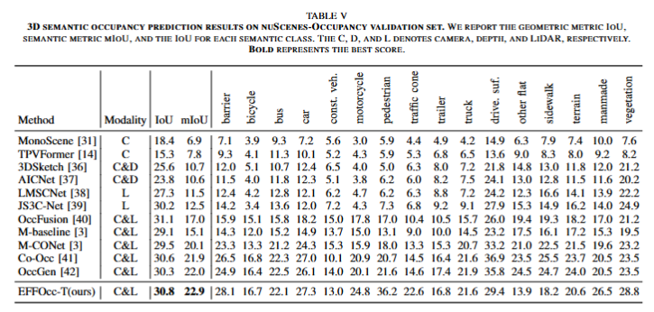

# EFFOcc
EFFOcc: A Minimal Baseline for EFficient Fusion-based 3D Occupancy Network

## Demo videos
We first provide lidar-camera occupancy prediction video of Occ3D-nuScenes dataset. 

https://github.com/synsin0/EFFOcc/assets/37300008/6ab8238f-1d7f-4e4b-b4de-daff6a99ba41

## Abstract（TL DR）
EFFOcc explores towards the minimal (minimal computation costs and minimal label costs) baseline for fast and high-performance 3D occupancy prediction with lidar-camera fusion. We show with proper detection pretraining, lightweight BEV-based fusion occnet can perform as well as voxel-based fusion occnets. Then, We conduct activate learning with maximum entropy on frame- and voxel-level to see the minimum label requirements for occupancy prediction.

## Main Results
EFFOcc on Occ3D-nuScenes dataset:

EFFOcc on Occ3D-Waymo dataset:

EFFOcc on OpenOccupancy-nuScenes dataset:

EFFOcc on two-stage active learning setting:

## Acknowledgements
Thanks to prior excellent open source projects:

- [BEVDet](https://github.com/HuangJunJie2017/BEVDet)
- [OpenOccupancy](https://github.com/JeffWang987/OpenOccupancy.git)
- [FlashOcc](https://github.com/Yzichen/FlashOCC)
- [CRB-active-3Ddet](https://github.com/Luoyadan/CRB-active-3Ddet)

